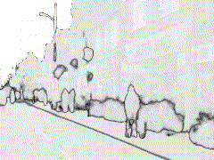
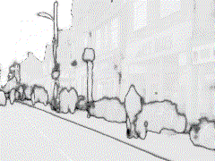
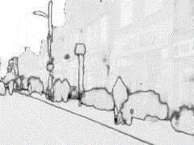
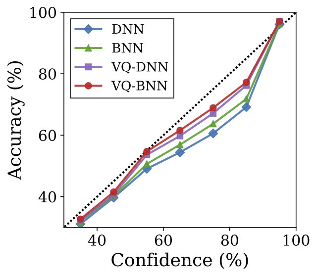

# Vector Quantized Bayesian Neural Network Inference for Data Streams

This repository provides an TensorFlow 2 implementation of ["Vector Quantized Bayesian Neural Network (VQ-BNN) Inference for Data Streams"](https://arxiv.org/abs/1907.05911) and other baselines on vision tasks e.g. semantic segmentation. This implementation can be a starting point for uncertainty estimation researches.  

__Motivation.__ Although Bayesian neural networks (BNNs) have a lot of theoretical merits such as estimating uncertainties, they has a major disadvantage that makes it difficult to use as a practical tool; *the predictive inference speed of BNNs is dozens of times slower than that of deterministic NNs.* 

VQ-DNN and VQ-BNN, *temporal smoothing* of recent predictions of deterministic NNs and BNNs, have been proposed to improve uncertainty estimation and computational performance of deterministic NNs and BNNs. It has the following advantages:

* The computational performance of VQ-BNN is almost the same as that of deterministic NN, and the predictive performance is comparable to or even superior to that of BNN. VQ-DNN estimates the uncertainty better than deterministic NN.
* Deterministic NN and BNN predict noisy results, while the VQ-DNN and VQ-BNN predict stabilized results. 
* This method is easy to implement. 

For more details, please refer to the [paper](https://arxiv.org/abs/1907.05911), [blog (theory)](https://blog.xxxnell.com/posts/vqbnn), and [blog (semantic segmentation)](https://blog.xxxnell.com/posts/temporal-smoothing).

<table cellspacing="15" style="width:100%;">
  <tr>
    <th>Input</th>
    <th>DNN 
(11 FPS)
</th>
    <th>VQ-DNN 
(10 FPS)
</th>
    <th>BNN 
(0.8 FPS)
</th>
    <th>VQ-BNN 
(9 FPS)
</th>
  </tr>
  <tr>
    <td></td>
    <td></td>
    <td></td>
    <td></td>
    <td></td>
  </tr>
  <tr>
    <td></td>
    <td></td>
    <td></td>
    <td></td>
    <td></td>
  </tr>
</table>

These are predictive results and uncertainties of deterministic NN (DNN), VQ-DNN, BNN, and VQ-BNN on CamVid. The results of DNN and BNN change irregularly and randomly. In contrast, the predictive results of VQ-DNN and VQ-BNN change smoothly, i.e., we might get more natural results by using temporal smoothing.

See [qualitative results document](resources/README.md) for more examples.

## Getting Started

The following packages are required:

* python==3.6
* matplotlib>=3.1.1
* tensorflow-gpu==2.0
* tensorboard

Then, see `semantic-segmentation.ipynb` for semantic segmentation experiment. 

The notebook provides deterministic and Bayesian [U-Net](https://link.springer.com/chapter/10.1007/978-3-319-24574-4_28) and [SegNet](https://arxiv.org/abs/1511.00561) by default. Bayesian U-Net and [Bayesian SegNet](https://arxiv.org/abs/1511.02680) contains [MC dropout](https://arxiv.org/abs/1506.02142) layers.

To conduct the experiment, it is required to download the training, test, and _sequence_ datasets manually. There are snippets available for handling [CamVid](http://mi.eng.cam.ac.uk/research/projects/VideoRec/CamVid/) and [CityScape](https://www.cityscapes-dataset.com/) datasets.

We define several metrics for measuring accuracy and uncertainty: Acuracy (Acc) and Acc for certain pixels, Intersection-over-Union (IoU) and IoU for certain pixels (IoU-90), negative log-likelihood (NLL), Expected Calibration Error (ECE), [Unconfidence (Unc-90)](https://arxiv.org/abs/1907.05911), and Frequency for certain pixels (Freq-90). We also provide reliability diagram for visualization.

## Results

<table cellspacing="3" style="width:90%;text-align:center;">
  <tr>
    <th>Method</th>
    <th>NLL 
(↓)
</th>
    <th>Acc 
(%, ↑)
</th>
    <th>ECE 
(%, ↓)
</th>
  </tr>
  <tr>
    <td>DNN</td><td>0.314</td><td>91.1</td><td>4.31</td>
  </tr>
  <tr>
    <td>BNN</td><td>0.276</td><td>91.8</td><td>3.71</td>
  </tr>
  <tr>
    <td>VQ-DNN</td><td>0.284</td><td>91.2</td><td>3.00</td>
  </tr>
  <tr>
    <td>VQ-BNN</td><td><b>0.253</b></td><td><b>92.0</b></td><td><b>2.24</b></td>
  </tr>
</table>

This table shows the performance of the methods with semantic segmentation task on the CamVid dataset. We use arrows to indicate which direction is better. According to these results, VQ-BNN performs siignificantly faster than BNNs while estimating predictive results comparable to or even superior to the results of BNNs.

This reliability diagram also shows consistent results that temporal smoothing is an effective method to calibrate results. For more detailed discussion, please refer to the [blog](https://blog.xxxnell.com/posts/temporal-smoothing).

## Theory of VQ-BNN Inference for Data Stream

It is very easy to implement VQ-BNN _inference_. VQ-BNN is simply the temporal exponential smoothing or _exponential moving average (EMA)_ of BNN's (or deterministic NN's) recent prediction sequence. More precisely, the predictive distribution of VQ-BNN is 

where  is integer timestamp,  are recent inputs,  are recent NN predictions (e.g. sigmoid of NN logits for classification tasks), and  are exponentially decaying importances of the predictions with hyperparameter . *No additional training is required.*

## License

All code is available to you under the Apache License 2.0.

Copyright the maintainers.

