# Qualitative Results of Semantic Segmentation on Video Sequences

This repository proposes _VQ-BNN inference_, a _temporal smoothing_ of BNN's recent predictions, in order to improve the computational performance of BNN. In addition, it also proposes _VQ-DNN_, which is a temporal smoothing of deterministic NN's predictions.
Experimental results show that the computational performance of VQ-BNN is almost the same as that of deterministic NN (DNN), and the predictive performance is comparable to or even superior to that of BNN. Similarly, the predictive performance of VQ-DNN is better than that of DNN.

This material provides predictive results and predictive uncertainties of DNN, VQ-DNN, BNN, and VQ-BNN on five different sequences.
According to these qualitative results, ___the predictive results of DNN and BNN are noisy___. Their classification results for an object change irregularly and randomly. In contrast, ___the predictive results of VQ-DNN and VQ-BNN are stabilized___. Their predictive results change smoothly. 

## Animated Predictive Results and Predictive Uncertainties

<table cellspacing="15" style="width:100%;">
  <tr>
    <th>Input</th>
    <th>DNN 
(11 FPS)
</th>
    <th>VQ-DNN 
(10 FPS)
</th>
    <th>BNN 
(0.8 FPS)
</th>
    <th>VQ-BNN 
(9 FPS)
</th>
  </tr>
  <tr>
    <th colspan="5" style="font-style:italic;">Seq 1</th>
  </tr>
  <tr>
    <td></td>
    <td></td>
    <td></td>
    <td></td>
    <td></td>
  </tr>
  <tr>
    <td></td>
    <td></td>
    <td></td>
    <td></td>
    <td></td>
  </tr>
  <tr>
    <th colspan="5" style="font-style:italic;">Seq 2</th>
  </tr>
  <tr>
    <td></td>
    <td>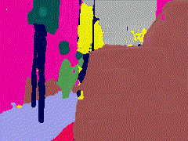</td>
    <td></td>
    <td>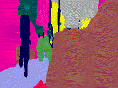</td>
    <td>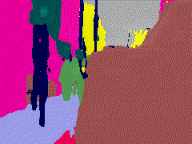</td>
  </tr>
  <tr>
    <td></td>
    <td>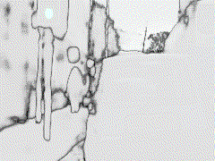</td>
    <td>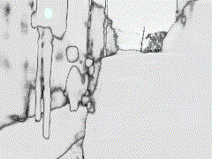</td>
    <td>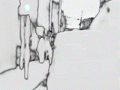</td>
    <td>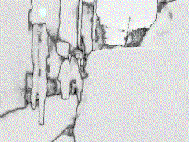</td>
  </tr>
  <tr>
    <th colspan="5" style="font-style:italic;">Seq 3</th>
  <tr>
    <td></td>
    <td>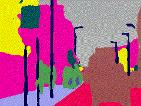</td>
    <td></td>
    <td>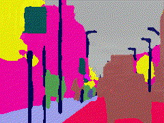</td>
    <td>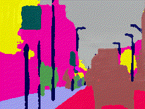</td>
  </tr>
  <tr>
    <td></td>
    <td>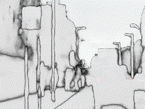</td>
    <td></td>
    <td>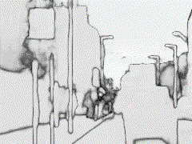</td>
    <td>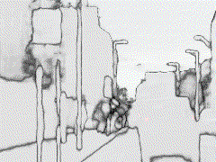</td>
  </tr>
  <tr>
    <th colspan="5" style="font-style:italic;">Seq 4</th>
  <tr>
    <td></td>
    <td>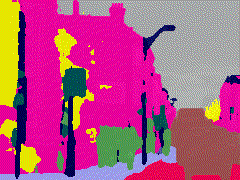</td>
    <td></td>
    <td>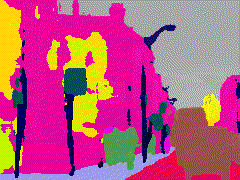</td>
    <td>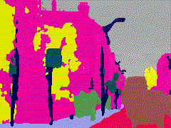</td>
  </tr>
  <tr>
    <td></td>
    <td>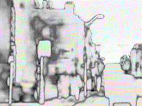</td>
    <td>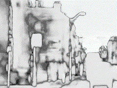</td>
    <td>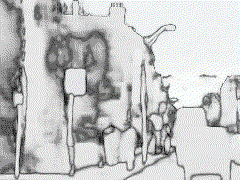</td>
    <td>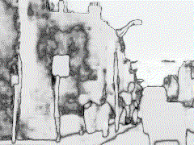</td>
  </tr>
  <tr>
    <th colspan="5" style="font-style:italic;">Seq 5</th>
  <tr>
    <td></td>
    <td>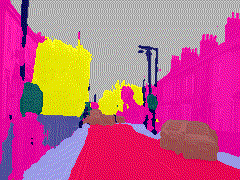</td>
    <td></td>
    <td>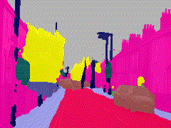</td>
    <td>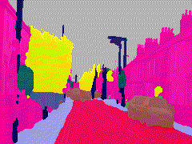</td>
  </tr>
  <tr>
    <td></td>
    <td>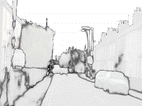</td>
    <td></td>
    <td>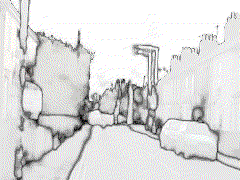</td>
    <td>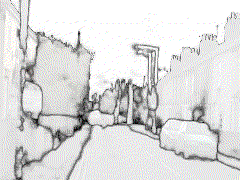</td>
  </tr>
</table>

